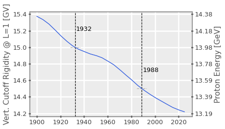

---
jupyter:
  jupytext:
    text_representation:
      extension: .md
      format_name: markdown
      format_version: '1.3'
      jupytext_version: 1.12.0
  kernelspec:
    display_name: 'Python 3.8.11 64-bit (''default'': conda)'
    name: python3
---

# Epoch-Dependent Rigidity Cutoff


The Störmer model of geomagnetic rigidity cutoff depends on the strength of the Earth's dipole moment. This varies with time, although commonly the values are taken for reference epochs. E.g., the commonly-used value of 60 corresponds to a reference epoch around 1932. For the case of vertically-incident particles the equation can be simplified and a factor of 4 appears in the denominator. Thus this is often presented as a coefficient with a value of 15. Later work by Smart and Shea uses a vertically-incident coefficient of 14.5. This corresponds to a reference epoch of around 1988.

To bring previous explorations of how the time-varying dipole moment impacts the coefficient used in the Störmer model, we'll graph the variation with time here.


First, import the packages we'll be using. Note that at the time of writing the `IGRF` module in SpacePy is not available in the main branch or releases; this is in pull request #296 at SpacePy's github repository.

```python
import datetime as dt
import numpy as np
from spacepy import igrf
import spacepy.time as spt
import spacepy.plot as splot
from ptm_python import ptm_tools as ptt

import matplotlib.pyplot as plt
%matplotlib inline
splot.style('default')
```

Now we'll instatiate an IGRF object and set up an array of times that we want to evaluate the magnetic moment at.

IGRF13 currently covers the period 1900 to 2025.

```python
magmod = igrf.IGRF()

epochs = spt.tickrange('1900-1-1', '2025-1-1', 30)
```

The next step is to loop over the times and, for each, calculate the moment of the centered dipole.

```python
moments = np.empty(len(epochs))
for idx, tt in enumerate(epochs):
    magmod.initialize(tt)
    moments[idx] = (magmod.moment['cd'])
```

The coefficient used in the vertical simplification of the Störmer model is equivalent to the cutoff rigidity for vertical incidence at L=1. This would be multiplied by 4 to obtain the moment in the mixed units used by Störmer. 

```python
lvals = [1]
cutoffs = np.empty([len(epochs), len(lvals)])
for idx, mm in enumerate(moments):
	sv = ptt.StormerVertical(mm)
	cutoffs[idx, :] = sv.cutoff_at_L(lvals, as_energy=False)
```

Having obtained the array of cutoff rigidities (or, equivalently, the coefficient for vertical incidence) as a function of epoch, we can plot these. We'll also convert the rigidities used in the tick labels to cutoff energy (assuming protons).

```python
dates = epochs.UTC
ind15 = np.argmin(np.abs(cutoffs - 15))
ind14p5 = np.argmin(np.abs(cutoffs - 14.5))
fig = plt.figure()
ax = fig.add_subplot(111)
ax.plot(epochs.UTC, cutoffs)
ax = plt.gca()
ax2 = ax.twinx()
ax2.grid(False)
ax.set_ylabel('Vert. Cutoff Rigidity @ L=1 [GV]')
ax.axvline(dates[ind15], c='k', ls='--')
ax.axvline(dates[ind14p5], c='k', ls='--')
ax.hlines(14.5, dates[ind14p5-50], dates[ind14p5+50], colors='darkgrey', ls='--')
_ = ax.text(dates[ind15+10], 15.2, dates[ind15].year)
_ = ax.text(dates[ind14p5+10], 14.7, dates[ind14p5].year)
plt.draw()
rig_vals = ax.get_yticklabels()
ax2.plot(dates, cutoffs)
ax2.set_yticklabels(['{:.2f}'.format(ptt.Proton.fromRigidity(float(rr.get_text())).energy/1e3) for rr in rig_vals])
ax2.set_ylabel('Proton Energy [GeV]')
_ = ax.hlines(15, dates[ind15-50], dates[ind15+50], colors='darkgrey', ls='--', zorder=99)

```

(If you're reading this as markdown rather than running as a Jupyter notebook, the output figure will look like the image embedded below)



```python
print(epochs[np.argmin(np.abs(cutoffs - 15))])
print(epochs[np.argmin(np.abs(cutoffs - 14.5))])
```

```python
dif = [(ep - dt.datetime(2017,9,9)).days for ep in epochs.UTC]
print(np.argmin(np.abs(dif)))
```

```python
epochs.ISO[1433]
```

```python
cutoffs[1432:1435]
```

```python
magmod.initialize(dt.datetime(2017,9,9))
```

```python
magmod.moment
```

```python

```
